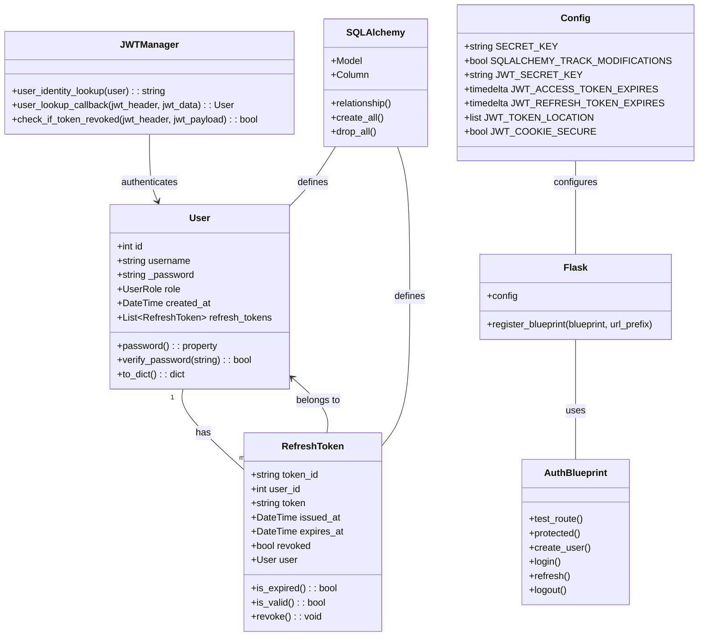
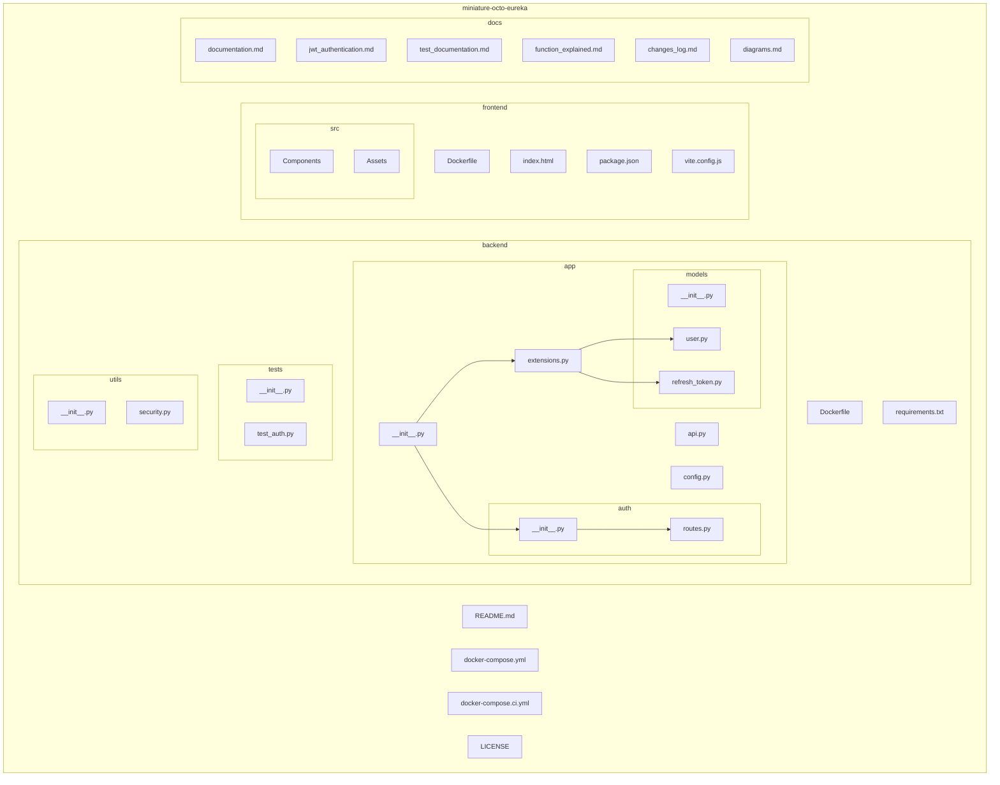
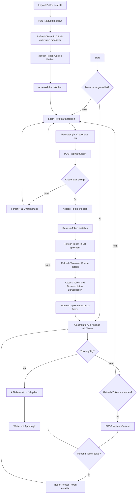
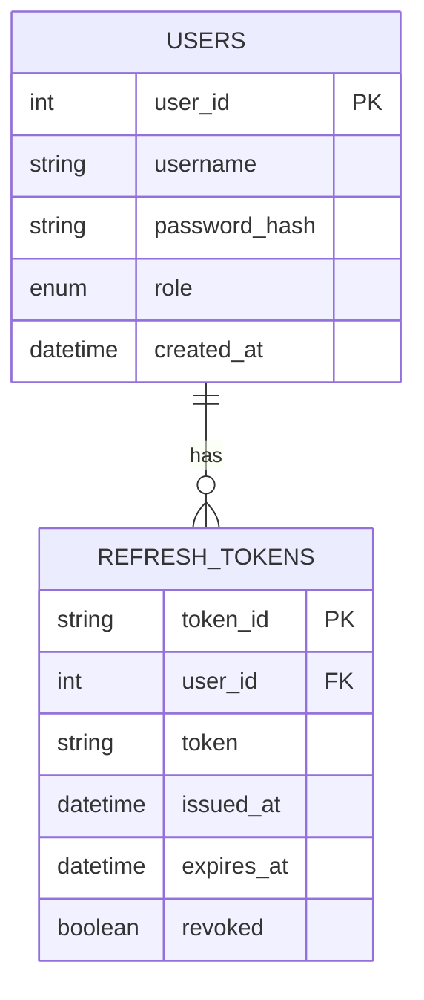

# Diagramme und Strukturen

Dieses Dokument enthält Diagramme und Visualisierungen der Projekt-Architektur für das miniature-octo-eureka Projekt.

## Klassendiagramm

## Strukturdiagramm

## Programmablaufplan: JWT Authentifizierung

## Datenbankschema

---

*Diagramme erstellt am: 21.05.2025*
